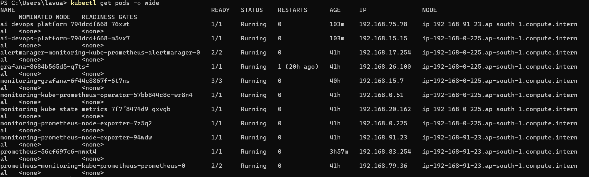
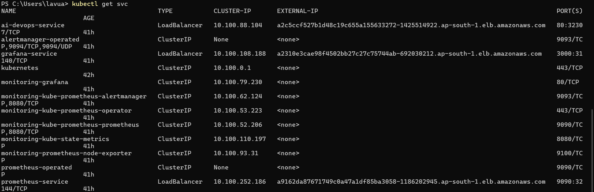
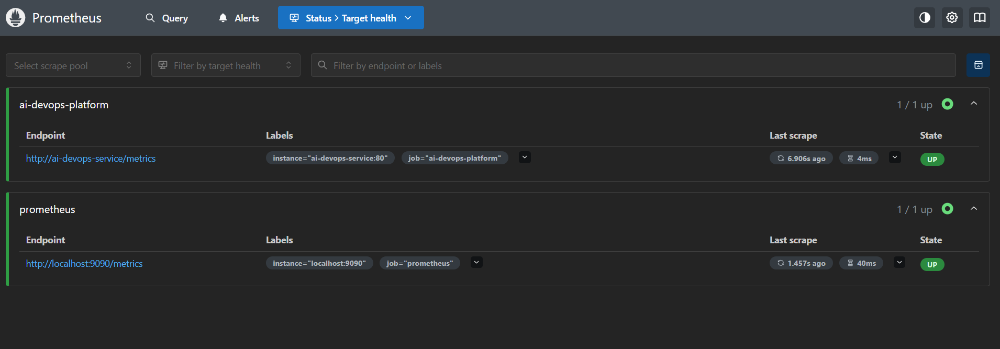
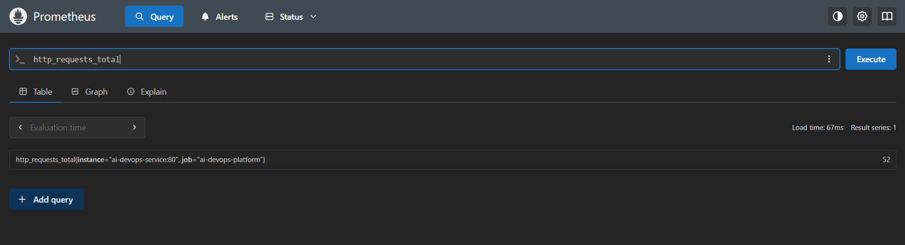
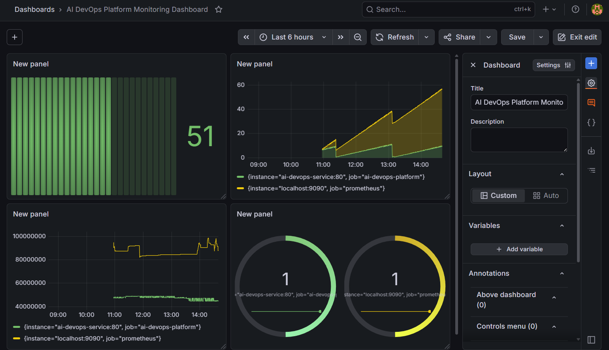
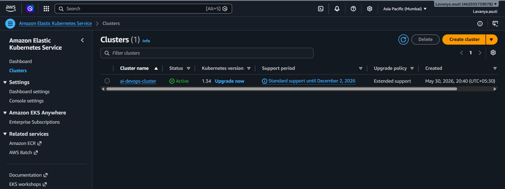
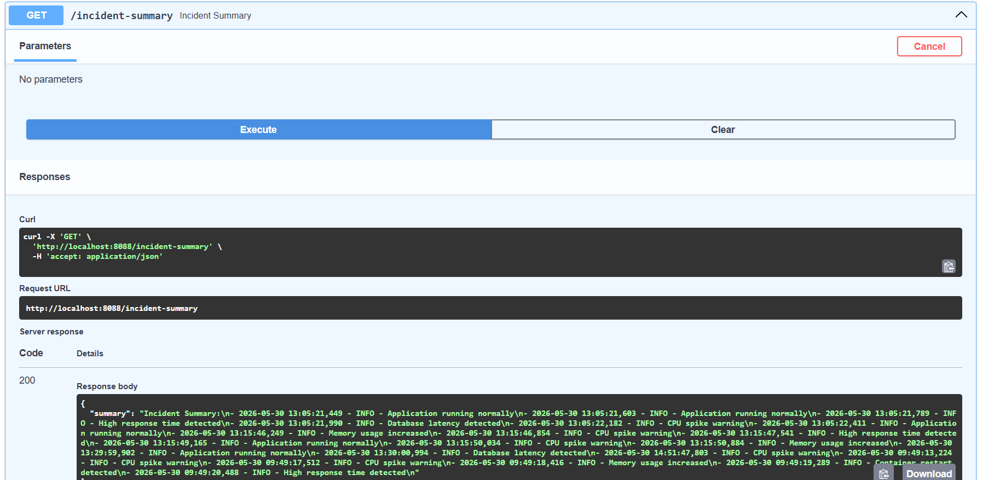

# AI DevOps Monitoring Platform

## Overview

AI DevOps Monitoring Platform is a cloud-native application built using FastAPI, Docker, Kubernetes, Prometheus, Grafana, and AWS EKS.

The project demonstrates how modern DevOps teams deploy, monitor, visualize, and alert on application health and performance metrics in a production-like Kubernetes environment.

The platform exposes application metrics, collects them using Prometheus, visualizes them through Grafana dashboards, and generates alerts based on predefined monitoring rules.

---

## Project Objectives

* Deploy a Python application on Kubernetes
* Containerize applications using Docker
* Implement monitoring using Prometheus
* Create dashboards using Grafana
* Configure alerting rules
* Simulate real-world DevOps monitoring workflows
* Gain hands-on experience with AWS EKS

---

## Technology Stack

| Category             | Technology     |
| -------------------- | -------------- |
| Programming Language | Python         |
| Framework            | FastAPI        |
| Containerization     | Docker         |
| Orchestration        | Kubernetes     |
| Cloud Platform       | AWS EKS        |
| Monitoring           | Prometheus     |
| Visualization        | Grafana        |
| Version Control      | Git & GitHub   |
| CI/CD Ready          | GitHub Actions |

---

## Architecture

User Request

↓

Load Balancer

↓

FastAPI Application (Kubernetes Pods)

↓

Prometheus Metrics Endpoint

↓

Prometheus

↓

Grafana Dashboards

↓

Alert Rules

↓

Operations Team

---

## Features

### Application Monitoring

* Request count tracking
* Application health endpoint
* Incident simulation
* Metrics exposure

### Prometheus Monitoring

* Service discovery
* Metric scraping
* Time-series data collection
* Querying using PromQL

### Grafana Dashboard

* Request monitoring
* Application uptime monitoring
* Memory usage visualization
* Interactive dashboards

### Alerting

* Service Down Alert
* High Request Rate Alert
* High Memory Usage Alert

---

## Kubernetes Resources

### Deployment

* 2 application replicas
* Rolling updates enabled
* High availability configuration

### Service

* LoadBalancer Service
* External access to application

### Monitoring Stack

* Prometheus
* Grafana
* Alertmanager
* Node Exporter
* Kube State Metrics

---

## API Endpoints

### Home Endpoint

GET /

Returns application status.

Example:

{
"message": "AI DevOps Platform Running",
"event": "CPU spike warning"
}

### Health Endpoint

GET /health

Returns application health status.

### Metrics Endpoint

GET /metrics

Exposes Prometheus metrics.

### Incident Summary Endpoint

GET /incident-summary

Provides summarized incident information.

---

## Prometheus Metrics

### Custom Metrics

http_requests_total

Tracks total number of application requests.

### System Metrics

* process_resident_memory_bytes
* process_cpu_seconds_total
* python_gc_objects_collected_total

---

## Grafana Dashboards

### Dashboard Metrics

* Total HTTP Requests
* Application Uptime
* Memory Consumption
* CPU Usage
* Active Targets

---

## Alert Rules

### Service Down

Triggers when:

up == 0

Severity:

critical

### High Request Rate

Triggers when:

rate(http_requests_total[5m]) > 10

Severity:

warning

### High Memory Usage

Triggers when:

process_resident_memory_bytes > 150000000

Severity:

warning

---

## Challenges Faced

### 1. Prometheus Target Discovery

Issue:
Application was not initially visible in Prometheus targets.

Resolution:
Configured ServiceMonitor and validated Kubernetes service labels.

### 2. Metrics Not Appearing

Issue:
Custom metrics were not visible.

Resolution:
Verified metrics endpoint and Prometheus scrape configuration.

### 3. Application Errors

Issue:
Application returned 500 Internal Server Error.

Root Cause:
Prometheus counter variable naming mismatch.

Example:

REQUEST_COUNT.inc()

while variable was defined as

request_count

Resolution:
Updated code and redeployed application.

### 4. Grafana Login Issues

Issue:
Unable to access Grafana dashboard.

Resolution:
Retrieved admin credentials from Kubernetes secrets.

### 5. Alert Rules Not Loading

Issue:
PrometheusRule resources were created but not visible.

Resolution:
Configured rule selectors and validated Prometheus operator configuration.

---

## Screenshots

### Application Running

### Kubernetes Pods

### Kubernetes Services

### Prometheus Targets

### Prometheus Query Results

### Grafana Dashboard

### Alert Rules

### AWS EKS Cluster

### Incident Summary

---

## Real World Use Cases

This architecture is commonly used in:

* Banking Platforms
* E-commerce Applications
* SaaS Products
* Healthcare Systems
* Cloud Native Applications
* Enterprise DevOps Teams

Organizations use similar monitoring stacks to:

* Detect outages quickly
* Monitor infrastructure health
* Track application performance
* Reduce downtime
* Improve reliability

---

## Learning Outcomes

Through this project I learned:

* Kubernetes deployment strategies
* Docker containerization
* AWS EKS cluster management
* Prometheus monitoring
* Grafana dashboard creation
* PromQL query development
* Alert configuration
* Cloud-native DevOps practices

---

## Future Enhancements

* CI/CD with GitHub Actions
* Slack Alert Integration
* Email Notifications
* Log Aggregation using ELK Stack
* OpenTelemetry Integration
* AI-Based Incident Detection

---

## Author

Lavanya Asuti

GitHub: https://github.com/Lavanya-Asuti

LinkedIn: https://linkedin.com/in/lavanya-asuti
